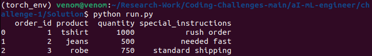

# Order Data Preprocessing for Multilingual Text

This Python project preprocesses order data containing multilingual text, including English, Bangla, Hindi, and occasionally Chinese. The data is processed to detect and translate non-English text into English, and then normalized for consistent formatting.

## Features

- **Language Detection**: Automatically detects the language of text in each field.
- **Translation**: Translates non-English text to English using the `deep-translator` library.
- **Normalization**: Converts text to lowercase and removes special characters.
- **Missing Data Handling**: Handles missing or null values in the data.

## Requirements

- Python 3.9
- `pandas` for data manipulation
- `langdetect` for language detection
- `deep-translator` for translation
- `re` for text normalization (built-in)

### Install Required Libraries

Before running the script, make sure to install the required libraries:

```bash
pip install -r requirements.txt
```

## Usage

### Run the script
```bash
python run.py
```

### Input Data

The input data should be a pandas DataFrame with at least two columns: `product` and `special_instructions`. These columns contain the order details, including multilingual text.

Sample Input:

```python
import pandas as pd

data = pd.DataFrame({
    'order_id': [1, 2, 3],
    'product': ['T-shirt', 'জিন্স', '衬衫'],
    'quantity': [1000, 500, 750],
    'special_instructions': ['Rush order', 'দ্রুত প্রয়োজন', 'Standard shipping']
})
```

### Sample Output

The function returns a DataFrame where all non-English text has been translated to English, and the text is normalized.



## Explanation of Functions

- **`detect_and_translate(text)`**: Detects the language of the text and translates it to English if necessary.
- **`normalize_text(text)`**: Converts text to lowercase and removes special characters.
- **`preprocess_order_data(df)`**: Applies language detection, translation, and normalization to the `product` and `special_instructions` columns in the input DataFrame.
