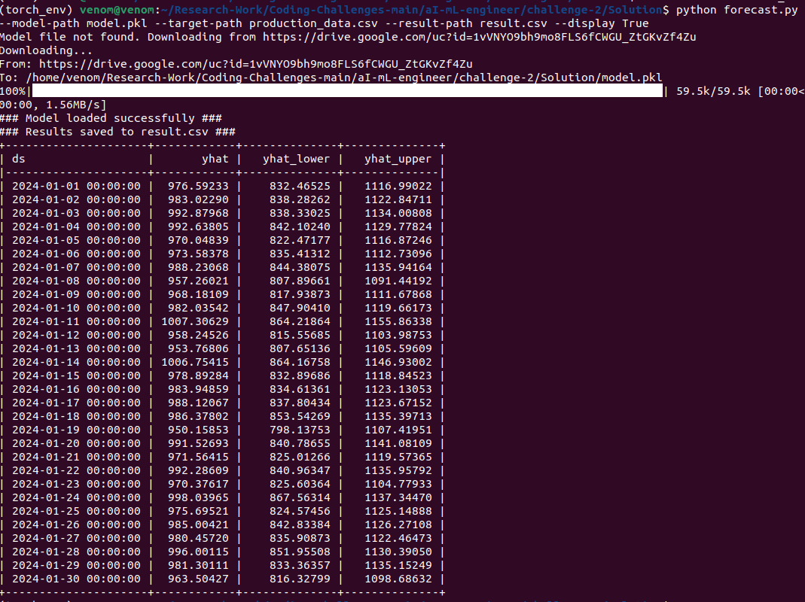

# Production Output Forecasting using Prophet

This project implements a time series forecasting model for predicting daily production output in a garment factory. The model uses historical production data and external factors such as worker attendance, power availability, and holidays to predict future production. The forecast is generated using a pre-trained [Prophet](https://facebook.github.io/prophet/) model and the results are saved to a CSV file.

## Approach

The approach taken for this project uses Facebook's Prophet model to forecast daily production output based on historical production data. The code simulates additional variables like worker attendance, power availability, and holidays to generate more realistic future predictions. The model forecasts for the next 30 days.

### Key Steps:

1. Load a pre-trained Prophet model from a pickle file.
2. Read historical data from a CSV file, ensuring the correct date format.
3. Simulate external factors for forecasting.
4. Forecast future production for 30 days.
5. Save the forecasted results to a CSV file.
6. Optionally display the forecast in the terminal.

## Assumptions

- The input CSV contains historical production data with columns for `Date`, `Worker Attendance`, and `Power Availability Hours`.
- Holidays are randomly assigned with a 10% probability.
- The pre-trained model is provided as a pickle file and can be downloaded if it doesn't exist locally.

## Instructions to Run the Code

1. **Clone the Repository**:
First, clone this repository to your local machine using the following command:

```bash
git clone https://github.com/AshfakYeafi/Coding-Challenges.git
cd /Coding-Challenges/aI-mL-engineer/challenge-2/Solution/
```

2. **Install dependencies**:
   Install the required Python packages using `pip`:

   ```bash
   pip install -r requirements.txt
   ```
3. **Prepare your data**:
   Ensure you have a CSV file with historical production data (with columns `Date`, `Worker Attendance`, and `Power Availability Hours`).
4. **Run the code**:
   Use the following command to run the script:

   ```bash
   python forecast.py --model-path model.pkl --target-path production_data.csv --result-path result.csv --display True
   ```

   - `--model-path`: Path to the pre-trained model (downloads automatically if missing).
   - `--target-path`: Path to the CSV file containing historical production data.
   - `--result-path`: Path to save the forecast results (default is `result.csv`).
   - `--display`: Whether to display forecast results in the terminal (`True`/`False`).

## Sample output


