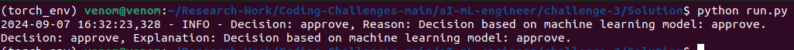

# Quality Control Agent for Garment Production

This project implements a machine learning-based quality control agent to classify garment production batches. It can decide to approve, reject, or escalate a batch based on the given input data.

## Prerequisites

To run this project, you will need:
- Python 3.9
- `scikit-learn` library for machine learning
- `NumPy` for numerical operations

### Install Dependencies

Use `pip` to install the required libraries:

```bash
pip install -r requirements.txt
```

## Running the Code

1. **Clone the Repository or Download the Script**
   - Save the Python file that contains the `QualityControlAgentML` class.
   
2. **Run the Script**

```bash
python run.py
```
### Sample Python Script

```python
# Import and set up the quality control agent
from quality_control_agent_ml import QualityControlAgentML

# Create a batch data dictionary
batch_data = {
    'measurements': {
        'length': 25.2,
        'width': 15.8,
        'sleeve_length': 22.1
    },
    'defect_rate': 0.02,
    'batch_size': 1000
}

# Initialize the agent and make a decision
agent_ml = QualityControlAgentML()
decision, explanation = agent_ml.make_decision(batch_data)

# Output the decision and explanation
print(f"Decision: {decision}")
print(f"Explanation: {explanation}")
```

3. **Expected Output**

   After running the code, the agent will output a decision and an explanation based on the input data.

## Sample Input and Output

### Sample Input

```python
batch_data = {
    'measurements': {
        'length': 25.2,
        'width': 15.8,
        'sleeve_length': 22.1
    },
    'defect_rate': 0.02,
    'batch_size': 1000
}
```

### Sample Output



### Model Explanation

The decision is based on the machine learning model, which has been trained on past batch data. The model assesses the measurements and defect rate to classify whether the batch should be approved, rejected, or escalated.

## Logging

The agent logs each decision, including the reasons, using Python's `logging` module. Logs can be found in the console output.

### Example Log Output

```
2024-09-06 12:00:00 - INFO - Decision: reject, Reason: Decision based on machine learning model: reject.
```

## Customization

- **Model Training**: You can customize the training of the decision tree model by providing your own dataset of past batches and their decisions.
- **Tolerances**: Adjust tolerances for the measurements and defect rate in the agent for more flexible decision-making.
```

