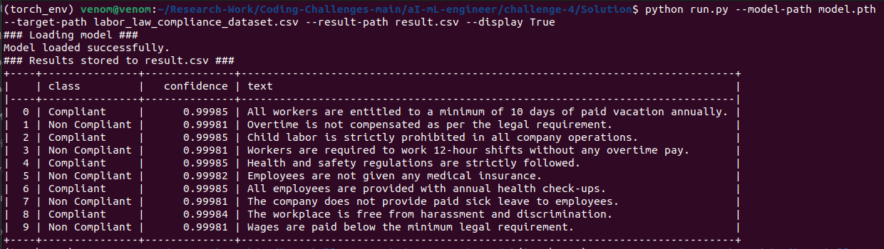

# Labor Law Compliance Text Classification

## Overview

This project utilizes a BERT-based model for classifying labor law compliance texts. The goal is to predict whether a given text is classified as "Compliant" or "Non Compliant" based on its content. The model is pre-trained using a transformer architecture (RoBERTa) and fine-tuned to suit this classification task.

## Approach

The project follows a systematic approach using Natural Language Processing (NLP) techniques:

- **Data Generation**: Dummy data is generated using `create_dummy_data.py` for training purposes.
- **Model Training**: The BERT model is trained using the dummy dataset in `train_model.ipynb`.
- **Text Classification**: The pre-trained model is then used to classify text into labor law compliance categories.
- **Preprocessing**: A custom `text_preprocessing_pipeline` is used to clean and normalize the text.

### Assumptions Made

1. The input data is clean and well-formatted in a CSV file.
2. The text in the dataset pertains to labor law compliance.
3. The model weights (`model.pth`) are available either locally or can be downloaded.
4. The task involves binary classification (Compliant/Non Compliant).

## Instructions to Run the Code

### 1. Clone the Repository

First, clone this repository to your local machine using the following command:

```bash
git clone https://github.com/your-username/labor-law-compliance-classifier.git
cd labor-law-compliance-classifier
```

### 2. Install Dependencies

The project relies on several Python libraries for machine learning and NLP tasks. You can install them using `pip`:

```bash
pip install -r requirements.txt
```

### 3. Download Pre-trained Model (Optional)

If the model file (`model.pth`) is not present in your directory, the script will automatically download it from Google Drive.

### 4. Run the Classifier

You can run the classifier on a CSV file that contains a column named `text` with labor law-related entries. Here's how to run the script:

```bash
python run.py --model-path model.pth --target-path labor_law_compliance_dataset.csv --result-path result.csv --display True
```

- `--model-path`: Path to the pre-trained model file (default: `model.pth`).
- `--target-path`: Path to the input CSV file (default: `labor_law_compliance_dataset.csv`).
- `--result-path`: Path where the classification results will be stored (default: `result.csv`).
- `--display`: (Optional) If you want to display the results in the terminal.

### 5. Output

After running the script, a `result.csv` file will be generated with the following columns:

- `text`: The original text from the dataset.
- `class`: Predicted class ("Compliant" or "Non Compliant").
- `confidence`: The confidence score for the predicted class.

Additionally, if you use the `--display` flag, the results will be printed in the terminal in tabular format.

## Sample Output

Here is a sample output of this project:


