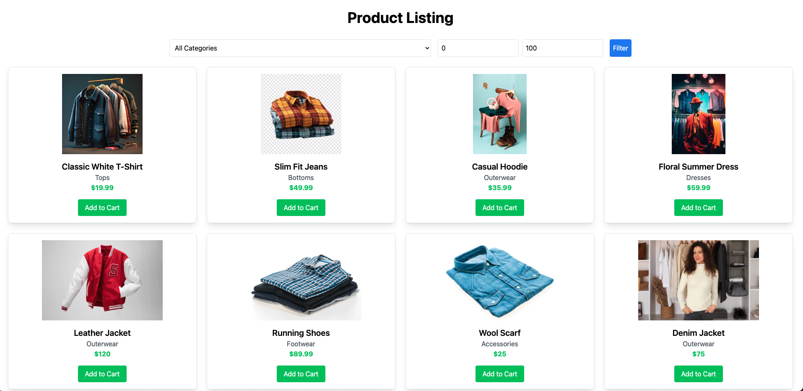

# React Artisans Product Listing Page with Tailwind CSS

This project is a responsive, modern product listing page built using **React** and **Tailwind CSS**. It features a persistent cart system, lazy-loaded images, product filtering, and responsive design optimized for both mobile and desktop users.

## Features

- **API Data Fetching**: Fetches product data from a provided API endpoint.
- **Responsive Design**: Displays products in a grid layout on desktop and a single-column layout on mobile.
- **Lazy Loading**: Optimizes performance by lazy loading product images, especially helpful for users on slower connections.
- **Product Filters**: Allows filtering of products by category and price range.
- **Add to Cart**: Users can add products to their cart, which is persisted across sessions using local storage.
- **Persistent Cart**: Cart data is stored locally, ensuring the items remain in the cart even after page reloads.

## Technologies Used

- **React**: JavaScript library for building user interfaces.
- **Tailwind CSS**: Utility-first CSS framework for styling.
- **Axios**: For making HTTP requests to fetch product data from an API.
- **LocalStorage**: To persist cart data across browser sessions.
- **react-lazyload**: To implement lazy loading for images.

## Prerequisites

Before running this project, ensure you have the following installed:

- [Node.js](https://nodejs.org/) (v12 or higher)
- [npm](https://www.npmjs.com/) (v6 or higher)

## Getting Started

Follow these steps to set up and run the project locally.

### 1. Clone the Repository

To get a copy of the project, clone the repository using the following command:

```bash
git clone https://github.com/your-repo/artisans.git 
```
Navigate into the project directory:
```bash
cd artisans
```

### 2. Install Dependencies

Once inside the project folder, run the following command to install all required dependencies:
```bash
npm install
```
### 3. Set Up Tailwind CSS

Ensure that Tailwind CSS is configured correctly. The necessary configuration is already included in the project setup (tailwind.config.js and CSS imports). No additional steps are required.

### 4. Start the Development Server

After installing the dependencies, start the development server using:
```bash
npm run dev
```
This will launch the app, and it should be running on http://localhost:5173.


